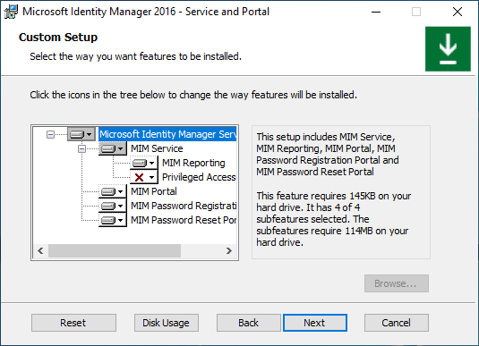

# Option 1: Group-managed service account + Office 365 application context authentication
# Option 2: Group-managed service account + no mail server

# Registering application using Azure AD portal
- Sign in to Azure AD portal with Global Administrator role.
- Navigate to Azure AD blade and copy your Tenant ID from Overview section and save it.
- Navigate to App registrations section and click New Registration button.
- Give your application a name, for example, MIM Service mailbox client access, and click Register.
- After your application is registered, copy the Application (client) ID value and save it.
- Navigate to API Permissions section and revoke User.Read permission by clicking on three dots right to permission name and choosing Remove Permission. Confirm that you want to remove this permission.
- Click on Add a permission button. Switch to APIs my organization uses and type Office. Select Office 365 Exchange Online and Application permissions type. Type full and select full_access_as app. Click Add Permissions button.
- You will see permission added and that admin consent is not granted. Click on Grant admin consent button next to Add a permission button.
```
Navigate to Certificates and secrets and choose to add New client secret. 
If you select an expiration time for the secret, you will have to reconfigure MIM Service closer to its expiration date to use another secret. 
If you do not plan to rotate application secrets, select Never. Give your secret a name, for example, MIM Service and click Add button. 
You will see the secret value displayed in the portal. Copy this value (not secret ID) and save it.
```
```
Now that you have Tenant ID, Application ID and application secret needed by installer you can continue with MIM Service and Portal installation. 
In addition, you may want to restrict access of your newly registered application to MIM Service mailbox only (full_access_as_app grants access to all mailboxes in your organization).
To do so, you need to create an application access policy. Follow this guide to restrict access of your application to the MIM Service mailbox only. 
You will need to create a distribution or mail-enabled security group and add your MIM Service mailbox into that group. 
```
# Then run a PowerShell command and provide your Exchange Online administrator credentials:

```PowerShell
New-ApplicationAccessPolicy `
-AccessRight RestrictAccess `
-AppId "<your application ID from step 5>" `
-PolicyScopeGroupId <your group email> `
-Description "Restrict MIM Service app to members of this group"
```
# Registering application using a PowerShell script
Create-MIMMailboxApp.ps1 script could be found either in Scripts.zip/Scripts/Service and Portal or in Service and Portal.zip\Service and 
Portal\Program Files\Microsoft Forefront Identity Manager\2010\Service\Scripts.
Unless your MIM Service mailbox is hosted in a national or government cloud, the only parameter you need to pass to the script is MIM Service email, for example, MIMService@contoso.onmicrosoft.com.

- From a PowerShell window start Create-MIMMailboxApp.ps1 with -MailboxAccountEmail parameter and provide MIM Service email.
```PowerShell
./Create-MIMMailboxApp.ps1 -MailboxAccountEmail <MIM Service email>
```
Deploying MIM Service and Portal
Common deployment steps
Create a temporary directory to keep installer logs in, for example, c:\miminstall.

Start elevated command prompt, navigate to MIM Service installer binaries folder and run
```cmd
msiexec /i "Service and Portal.msi" /lvxi* c:\miminstall\log.txt
```
- In the welcome screen, click Next.
- Review the End-User License Agreement and click Next if you accept the license terms.
- Select Azure AD in Azure Cloud Dropdown
- After selecting the appropriate cloud, the installer will ask you to authenticate to that tenant. In the popup window, provide Azure AD user credentials. Type your Azure AD username and click Next.
- Once the license check is complete, select MIM Service and Portal components to install and click Next.
- 
- Provide the SQL server and database name. Choose to reuse the existing database if upgrading from previous MIM versions. 
- If installing using SQL failover cluster or Always-On Availability Groups Listener, provide a cluster or a listener name. Click Next.
- If installing MIM using an existing database, a warning appears. Click Next.
- Choose a combination of mail server type and authentication method - Application Context Authentication 
- Check the box for use Group Managed Service Account
- If installing MIM Reporting component, type System Center Service Manager management server name and click Next. - Skip this
- Provide the Azure AD Application ID, Tenant ID and Client Secret, that were generated by a script earlier. Click Next.
- Choose to generate a new self-signed certificate. Click Next.
- Type MIM Service group-managed service account name, domain name and MIM Service Office 365 mailbox SMTP address. Click Next. Don't forget the $ at the end of the gMSA account
- Type MIM Synchronization Server hostname. Type MIM Management Agent account name. 
- If you are installing MIM Synchronization Service using Group-Managed Service Account, then add the dollar sign to the account name, for example, contoso\MIMSyncGMSAsvc$. Click Next.
- Type MIM Service Server hostname. In a case a load-balancer is used to balance MIM Service payload, provide the name of the cluster. Click Next.
- Provide SharePoint site collection name. Make sure to replace http://localhost with a proper value. Click Next.
- Timer service warning just hit next
- If installing Self-Service Password Registration website, specify a URL MIM clients will be redirected to after logon. Click Next i.e. https://pwreg.contoso.com
- Select the checkbox to open ports 5725 and 5726 in the firewall, and the checkbox to grant all authenticated users access to MIM Portal. Click Next.
- If installing Self-Service Password Registration website, set the application pool account name and its password, the host name and the port for the website. 
- Enable the Open port in firewall option if needed. Click Next. Leave it port 80 for Now
- Hit next at the SSL warning
- In the next MIM Password Registration Portal configuration screen, 
- type the MIM Service Server Address for the Password Registration Portal and select whether this website will be accessible by intranet users. Click Next.
- If installing Self-Service Password Reset website, set the application pool account name and its password, the host name and the port for the website. 
- Enable the Open port in firewall option if needed. Click Next. leave it port 80 for Now
- Next on the SSL warning screen
- In the next MIM Password Reset Portal configuration screen, 
- type the MIM Service Server Address for the Password Reset Portal and select whether this website will be accessible by intranet users. Click Next.
- When all pre-installation definitions are ready, click Install to begin installing the selected Service and Portal components.
# Post-installation tasks
- After installation completes, verify that the MIM Portal is active.
- Launch Internet Explorer and connect to the MIM Portal on http://mim.contoso.com/identitymanagement. Note, that there may be a short delay on the first visit to this page.
- If necessary, authenticate as a user, that installed MIM Service and Portal, to Internet Explorer.
- In Internet Explorer, open the Internet Options, change to the Security tab, and add the site to the Local intranet zone if it is not already there. Close the Internet Options dialog.
- In Internet Explorer, open the Settings, change to the Compatibility view settings tab, and uncheck Display Intranet Sites in Compatibility view checkbox. Close Compatibility View dialog.
# Enable non-administrators to access MIM Portal.
- Using Internet Explorer, in MIM Portal, click on Management Policy Rules.
- Search for the management policy rule, User management: Users can read attributes of their own.
- Select this management policy rule, uncheck Policy is disabled.
- Click OK and then click Submit.